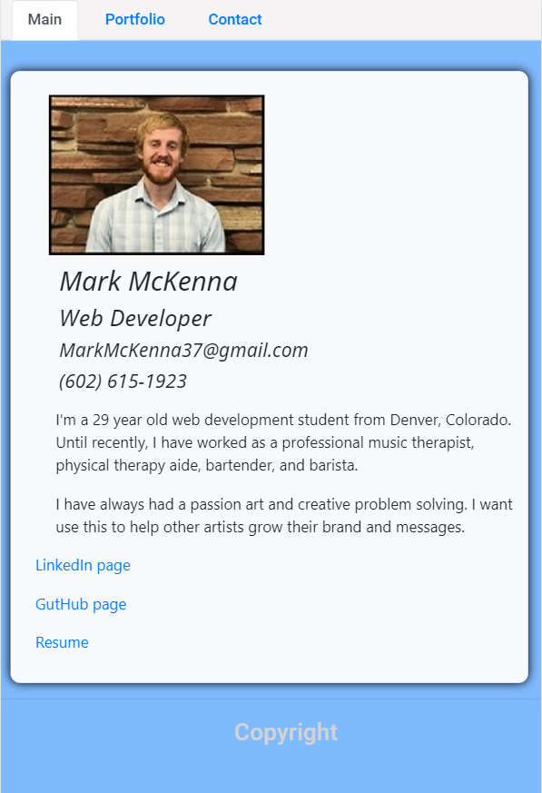

# Professional-Portfolio-Page

GitHub link: https://github.com/markmckenna37/Professional-Portfolio-Page
Live link: https://markmckenna37.github.io/Professional-Portfolio-Page/

For this project we were tasked with making updates and adjustments to our 2nd homework assignment: responsive portfolio.
Updates included adding a link to the PDF of my resume, changing about-me content to include a brand statement, and adding links/screenshots for my projects.
Adjustments included fixing Bootstrap responsiveness, changing background colors, and adjusting picture sizes.
